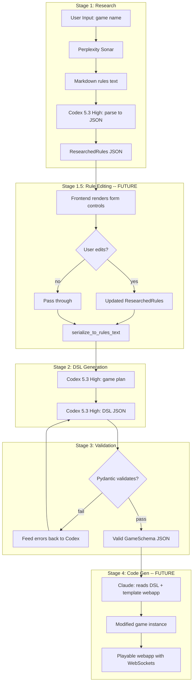
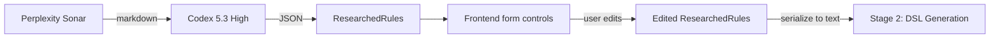
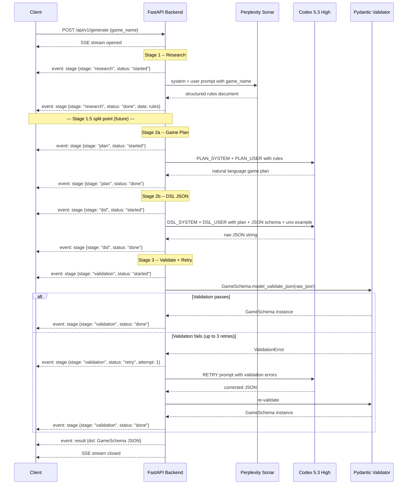
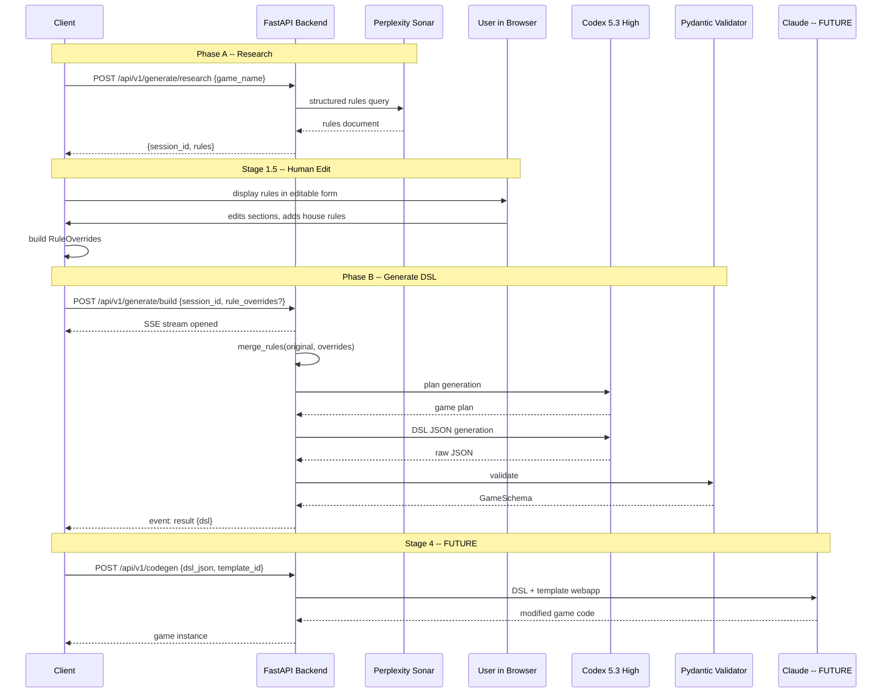

# Boardify DSL Pipeline for Generalized Card Games

## Architecture Overview

The pipeline has 5 stages. Stages 1, 2, and 3 are implemented now. Stages 1.5 and 4 are future work.



### Provider roles

- **Perplexity Sonar** -- web search for authoritative game rules (Stage 1)
- **User** -- reviews and optionally edits the researched rules (Stage 1.5, future). Can correct errors, add house rules, remove unwanted mechanics, or clarify ambiguities before DSL generation.
- **OpenAI Codex 5.3 High** -- DSL plan generation and JSON schema output (Stage 2), retry corrections (Stage 3)
- **Claude** -- code generation against the templated board game webapp (Stage 4, future). Receives the validated DSL JSON + the template app source and produces a modified game instance with all components, game logic, and WebSocket event handlers wired up.

### Stage 1 output: structured ResearchedRules model

The Perplexity response is markdown text, but the pipeline needs structured data that:

1. The frontend can render as form controls (number inputs, toggles, dropdowns)
2. The user can directly edit (card counts, player range, enable/disable mechanics)
3. Can be serialized back to text for Stage 2 (Codex DSL generation)

**Two-step approach:**

- Step 1a: Perplexity Sonar returns markdown (good at web search, natural text)
- Step 1b: Codex parses the markdown into `ResearchedRules` JSON (structured output validated by Pydantic)



File: `backend/app/schemas/research.py`

```python
class CardTypeResearch(BaseModel):
    """A distinct card type. Frontend renders as a row in an editable table."""
    name: str = Field(..., description="Card type name, e.g. 'Skip', 'Wild Draw Four', 'Exploding Kitten'")
    count: int = Field(..., ge=0, description="Number of this card in the deck. UI: number spinner.")
    count_rule: str | None = Field(
        None,
        description="Dynamic count formula if count depends on player count. "
        "e.g. 'players - 1' for Exploding Kittens. UI: shown as help text next to count."
    )
    properties: dict[str, str | int | None] = Field(
        default_factory=dict,
        description="Card attributes: {color, suit, rank, value, type}. UI: key-value pills."
    )
    effect: str = Field("", description="What this card does when played/drawn. UI: text input.")
    category: str | None = Field(
        None,
        description="Grouping label: 'number', 'action', 'wild', 'cat', 'explosive', etc. "
        "UI: used to group cards in the table."
    )


class ZoneResearch(BaseModel):
    """A game zone. Frontend renders as a card in a zone list."""
    name: str = Field(..., description="Zone identifier, e.g. 'draw_pile', 'discard_pile', 'player_hand'")
    display_name: str = Field(..., description="Human-readable name, e.g. 'Draw Pile'")
    description: str = Field("", description="What this zone is for")
    visibility: str = Field(..., description="Who can see cards: hidden, top_only, owner_only, all")
    per_player: bool = Field(False, description="Is there one per player (e.g. hand)?")


class TurnPhaseResearch(BaseModel):
    """A phase in the turn structure."""
    name: str
    description: str
    mandatory: bool = Field(True, description="Must the player complete this phase? UI: toggle.")


class SpecialMechanic(BaseModel):
    """A game mechanic that can be toggled on/off by the user."""
    name: str = Field(..., description="Short name, e.g. 'Nope interrupts', 'Stacking Draw 2'")
    description: str = Field(..., description="What this mechanic does")
    enabled: bool = Field(True, description="UI: toggle switch. User can disable to simplify game.")
    category: str = Field(
        "core",
        description="'core' (required for game to work), 'optional' (can be toggled), 'house_rule' (user-added)"
    )


class CardEffectResearch(BaseModel):
    """What a card type does when played."""
    card_name: str = Field(..., description="Which card type this effect applies to")
    trigger: str = Field("on_play", description="When the effect fires: on_play, on_draw, on_discard, combo")
    description: str = Field(..., description="What happens. UI: editable text area.")
    targets_player: bool = Field(False, description="Does this effect target another player?")


class ResearchedRules(BaseModel):
    """Structured research output. Every field maps to a frontend form control.

    This model is what the frontend renders as an editable form.
    Users adjust card counts, toggle mechanics, set player ranges, etc.
    """

    # --- General game controls (top of form) ---
    game_name: str = Field(..., description="UI: text input, pre-filled")
    player_count_min: int = Field(..., ge=1, description="UI: number spinner")
    player_count_max: int = Field(..., ge=1, description="UI: number spinner")
    estimated_play_time_minutes: int | None = Field(None, ge=1, description="UI: number spinner, optional")
    win_condition_type: str = Field(
        ...,
        description="UI: dropdown. Options: first_empty_hand, last_alive, highest_score, "
        "most_sets, best_hand, custom"
    )
    win_condition_description: str = Field(..., description="UI: text input for details")

    # --- Deck composition (editable card table) ---
    card_types: list[CardTypeResearch] = Field(
        ...,
        description="UI: editable table. Columns: name, count (spinner), properties, effect. "
        "User can add/remove rows."
    )

    # --- Game structure ---
    zones: list[ZoneResearch] = Field(..., description="UI: list of zone cards")
    turn_phases: list[TurnPhaseResearch] = Field(
        ..., description="UI: ordered list with drag-to-reorder and mandatory toggle"
    )

    # --- Card effects (editable) ---
    card_effects: list[CardEffectResearch] = Field(
        default_factory=list,
        description="UI: expandable list per card type"
    )

    # --- Mechanics toggles ---
    special_mechanics: list[SpecialMechanic] = Field(
        default_factory=list,
        description="UI: toggle list. Core mechanics shown but not disableable. "
        "Optional mechanics have toggle switches. User can add house rules."
    )

    # --- Flags (derived from mechanics, shown as info chips) ---
    has_interrupts: bool = Field(False, description="Does the game have out-of-turn reaction cards?")
    has_player_elimination: bool = Field(False, description="Can players be eliminated mid-game?")
    has_combos: bool = Field(False, description="Can multiple cards be played together?")
    has_scoring: bool = Field(False, description="Does the game use a point system?")
    has_betting: bool = Field(False, description="Does the game have a pot/betting mechanic?")

    # --- Reference ---
    raw_rules_text: str = Field(
        ...,
        description="Original Perplexity markdown. UI: collapsible 'Raw Rules' section at bottom. "
        "Read-only reference so user can cross-check edits."
    )

    # --- House rules (user-added free text) ---
    additional_rules: str | None = Field(
        None,
        description="UI: text area at bottom. User can type custom rules or clarifications. "
        "Appended as-is to the rules text sent to Stage 2."
    )
```

**Parsing prompt** (Codex extracts structured data from Perplexity markdown):

File: `backend/app/pipeline/prompts/parse_research.py`

```python
PARSE_SYSTEM = """You are a data extraction engine. Parse the game rules document
into the exact JSON schema provided. Extract every card type with its EXACT count.
If a count depends on player number, put the formula in count_rule and use the
count for a typical game (e.g. 4 players)."""

PARSE_USER = """## Raw Rules Document
{raw_rules_text}

## Output JSON Schema
{research_schema}

Parse the rules into this exact schema. Include ALL card types, ALL zones,
ALL turn phases, ALL special mechanics. Set the boolean flags (has_interrupts,
has_player_elimination, etc.) based on the rules content.

Output ONLY valid JSON."""
```

**Serialization back to text** (for Stage 2):

When the user finishes editing and the pipeline continues to Stage 2, the `ResearchedRules` is serialized back to a rules text document that Codex can consume:

```python
def serialize_to_rules_text(rules: ResearchedRules) -> str:
    """Convert structured ResearchedRules back to markdown for Stage 2."""
    sections = []

    sections.append(f"# {rules.game_name}")
    sections.append(f"Players: {rules.player_count_min}-{rules.player_count_max}")
    if rules.estimated_play_time_minutes:
        sections.append(f"Play time: ~{rules.estimated_play_time_minutes} minutes")
    sections.append(f"Win condition: {rules.win_condition_type} -- {rules.win_condition_description}")

    sections.append("\n## DECK COMPOSITION")
    for ct in rules.card_types:
        count_note = f" ({ct.count_rule})" if ct.count_rule else ""
        props = ", ".join(f"{k}={v}" for k, v in ct.properties.items()) if ct.properties else ""
        sections.append(f"- {ct.name}: {ct.count} cards{count_note}. {props}. {ct.effect}")

    sections.append("\n## GAME ZONES")
    for z in rules.zones:
        sections.append(f"- {z.display_name} ({z.name}): {z.description}. Visibility: {z.visibility}")

    sections.append("\n## TURN STRUCTURE")
    for i, tp in enumerate(rules.turn_phases, 1):
        sections.append(f"{i}. {tp.name}: {tp.description} {'(mandatory)' if tp.mandatory else '(optional)'}")

    sections.append("\n## CARD EFFECTS")
    for ce in rules.card_effects:
        sections.append(f"- {ce.card_name} ({ce.trigger}): {ce.description}")

    sections.append("\n## SPECIAL MECHANICS")
    for sm in rules.special_mechanics:
        if sm.enabled:
            sections.append(f"- {sm.name}: {sm.description}")
        else:
            sections.append(f"- ~~{sm.name}~~: DISABLED BY USER")

    if rules.additional_rules:
        sections.append(f"\n## ADDITIONAL RULES (USER)\n{rules.additional_rules}")

    return "\n".join(sections)
```

### Stage 1.5 design notes (future, not implemented now)

After Stage 1 produces `ResearchedRules`, the user gets a chance to review and edit before DSL generation. This is important because:

- Perplexity may get card counts wrong or miss obscure rules
- Users may want to add house rules (e.g. "stacking Draw 2 cards")
- Some games have regional variants the user wants to pick
- The user may want to simplify a complex game (disable betting in Poker, disable Nope cards, etc.)

**Frontend form layout** (how `ResearchedRules` maps to UI):

```
+----------------------------------------------+
| Game: [Exploding Kittens     ]  (text input)  |
| Players: [2] to [5]           (number spinners)|
| Play time: [15] min           (number spinner) |
| Win condition: [Last alive v]  (dropdown)      |
+----------------------------------------------+

| DECK COMPOSITION                              |
| Name          | Count | Properties  | Effect   |
|---------------|-------|-------------|----------|
| Exploding K.  | [3]   | explosive   | Death    |
| Defuse        | [6]   | action      | Save     |
| Attack        | [4]   | action      | 2 turns  |
| Skip          | [4]   | action      | No draw  |
| Nope          | [5]   | reaction    | Cancel   |
| Tacocat       | [4]   | cat         | Combo    |
| ...           |       |             |          |
| [+ Add card type]                              |
+----------------------------------------------+

| MECHANICS                                     |
| [x] Nope interrupts (core)                    |
| [x] Cat card combos (core)                    |
| [x] 5-different combo (optional)       [toggle]|
| [ ] Stacking attacks (house rule)      [toggle]|
| [+ Add house rule]                             |
+----------------------------------------------+

| ADDITIONAL RULES                               |
| [                                        ]     |
| [  Free text area for house rules        ]     |
+----------------------------------------------+
```

**Architectural impact -- why this shapes the current design:**

The pipeline must be **splittable** at the research boundary. Instead of one continuous stream, we need:

1. **Phase A** (`POST /api/v1/generate/research`) -- runs Stage 1 (Perplexity + Codex parse), returns `ResearchedRules` JSON, stores it keyed by `session_id`
2. **User edits** -- client renders `ResearchedRules` as form, user modifies fields
3. **Phase B** (`POST /api/v1/generate/build`) -- accepts `session_id` + edited `ResearchedRules`, serializes to text, runs Stages 2-3

This is why the orchestrator's `generate_game_dsl()` accepts a `research` parameter rather than only `game_name` -- so it can receive pre-edited, serialized rules from Phase A. The current implementation runs both phases back-to-back (no pause), but the interface is already designed to split.

### Stage 4 design notes (future, not implemented now)

The templated board game webapp already has:

- WebSocket infrastructure for real-time multiplayer
- Generic UI components (card rendering, zones, player panels, action buttons)
- Game state management shell

Claude's job in Stage 4 will be to take the validated `GameSchema` JSON and:

1. Wire deck_manifest into the card rendering system
2. Map zones to the zone layout components
3. Implement the FSM (turn phases, routines) as game state transitions
4. Bind actions to UI event handlers (click_card, click_zone, click_button, reaction)
5. Implement card_effects as post-play hooks
6. Handle reaction_windows as interrupt UI flows
7. Connect everything to the WebSocket event system

This stage will be a separate pipeline step with its own prompt template that includes the DSL JSON and key template webapp source files as context.

### Core insight for generalization

**The Pydantic schema IS the prompt.** When you call `GameSchema.model_json_schema()`, it produces a JSON Schema with all your `Field(description=...)` annotations baked in. This schema gets passed directly to Codex 5.3 High as its output format constraint. Every description you write on a Pydantic field becomes documentation the LLM reads.

---

## 1. Pydantic Schema Design (the "generalization grammar")

### File structure

```
backend/app/schemas/
    primitives.py    # ValueRef, Condition, PlayerCount
    operations.py    # All op types + Operation discriminated union
    components.py    # Zone, DeckManifestEntry, CardEffect, Variables
    actions.py       # Action (with reaction_window, combos), FSM
    game.py          # GameSchema (top-level)
    __init__.py      # Re-exports GameSchema
```

### Key technique: Discriminated unions for operations

The `op` field is the discriminator. Each operation gets its own model with a `Literal` op type, so the LLM knows exactly which fields belong to which operation:

```python
from typing import Annotated, Literal, Union
from pydantic import BaseModel, Field

class MoveOp(BaseModel):
    op: Literal["move"] = "move"
    entity: str | None = Field(None, description="Card ref like '$card'. Omit when using from+count.")
    from_: str | None = Field(None, alias="from", description="Source zone name, e.g. 'draw_pile', or '$args.target_player.hand' for stealing")
    to: str = Field(..., description="Dest zone or '$player.hand'")
    count: int | str | None = Field(None, description="Cards to move. Int or '$global.stack_penalty'")
    random: bool = Field(False, description="If true, pick card(s) randomly from source (for stealing)")
    store_as: str | None = Field(None, description="Store moved card(s) in $args.{name}")

class BranchOp(BaseModel):
    op: Literal["branch"] = "branch"
    condition: "Condition" = Field(..., description="Boolean condition tree")
    if_true: list["Operation"] = Field(..., description="Sequence when true")
    if_false: list["Operation"] = Field(default_factory=list, description="Sequence when false")

# ... ~24 total op types

Operation = Annotated[
    Union[MoveOp, ShuffleOp, DealOp, BranchOp, SetGlobalOp, ...],
    Field(discriminator="op")
]
```

### Complete operation set (~24 ops)

**Core ops (from Uno DSL):**

- `spawn_from_manifest` -- create cards from deck manifest templates
- `shuffle` -- randomize a zone
- `deal` -- distribute cards to all players
- `move` -- move card(s) between zones (now with `random` flag for stealing)
- `move_all_except_top` -- recycle zone leaving top card
- `set_global` -- set a global variable
- `set_player_var` -- set a per-player variable
- `mutate_global` -- arithmetic mutation (add, negate, multiply)
- `branch` -- conditional if/else with nested sequences
- `advance_turn` -- move to next player (skips eliminated players)
- `transition_phase` -- change FSM phase
- `trigger_routine` -- call a named routine
- `prompt` -- ask player to choose from options (color pick, etc.)
- `game_over` -- end game with winner
- `log` -- debug/UI message

**Broad card game ops (Poker, Rummy, Go Fish, War):**

- `reveal` -- flip hidden cards face-up
- `evaluate_hand` -- rank a hand by rule set (poker_standard, rummy_sets_runs)
- `compare_hands` -- compare two hands and branch on winner
- `add_score` -- add/subtract points per player
- `collect_to_pot` / `award_pot` -- betting mechanics
- `for_each_player` -- iterate over all players with a sequence
- `check_group` -- test if cards form a valid set/run

**Exploding Kittens ops (interrupts, targeting, elimination):**

- `**peek**` -- view top N cards of a zone without moving them (See the Future)
- `**insert_at**` -- insert a card at a player-chosen position in a zone (Defuse mechanic)
- `**choose_player**` -- prompt player to select a target, store as `$args.{name}` (Favor, cat combos)
- `**eliminate_player**` -- remove player from game, skip in turn order (Exploding Kitten death)
- `**choose_from_zone**` -- pick a specific card from a visible zone (5-different cat combo picking from discard)

### Exploding Kittens gap analysis -- why these ops are needed

| Mechanic                            | DSL Gap                    | Solution                                                               |
| ----------------------------------- | -------------------------- | ---------------------------------------------------------------------- |
| **Nope (interrupt)**                | No out-of-turn play        | `reaction_window` on Action + `any_phase` flag                         |
| **See the Future**                  | No peek without moving     | `peek` op                                                              |
| **Defuse + reinsert**               | `move` always goes to top  | `insert_at` op with `position: "player_choice"`                        |
| **Favor (give card)**               | No targeting other players | `choose_player` op + `prompt` with `player: "$args.target"`            |
| **Cat combo (steal)**               | No random steal            | `move` with `random: true` + `from: "$args.target.hand"`               |
| **3-of-a-kind (named steal)**       | No named card steal        | `prompt` (name a card) + `branch` (has it?) + `move`                   |
| **5-different (pick from discard)** | No browsing a zone         | `choose_from_zone` op                                                  |
| **Exploding Kitten (death)**        | No player elimination      | `eliminate_player` op                                                  |
| **Attack (multi-turn)**             | No turn count modification | `turns_remaining` per-player var + `mutate_player_var` op              |
| **Free play phase**                 | `max_per_turn: 1` forced   | `max_per_turn: null` (nullable int)                                    |
| **Multi-card combos**               | Single-card actions only   | `card_count` + `card_match_rule` on Action                             |
| **Draw triggers**                   | No on-draw event           | `on_draw` trigger in Zone config or `branch` after `move` + `store_as` |

### FSM / Action extensions for interrupt games

```python
class ReactionWindow(BaseModel):
    """After this action resolves, other players may play reaction cards."""
    eligible_card_type: str = Field(..., description="Card type that can react, e.g. 'nope'")
    allows_chain: bool = Field(True, description="Can reactions be reacted to? (Nope the Nope)")
    timeout_seconds: int | None = Field(None, description="Seconds before window closes. null=until all pass")

class Action(BaseModel):
    phase: str | list[str] = Field(..., description="Phase(s) when this action is available")
    trigger: str = Field(..., description="UI trigger: click_card, click_zone, click_button, reaction")
    source_zone: str | None = Field(None)
    mutex_group: str | None = Field(None)
    max_per_turn: int | None = Field(None, description="Max times per turn. null=unlimited (free play). 1=once.")
    card_count: int = Field(1, description="Cards required for this action. 2 for two-of-a-kind combo, 3 for three-of-a-kind, 5 for five-different.")
    card_match_rule: str | None = Field(None, description="'same_type' for matching combos, 'all_different' for 5-different combo, null for single card")
    any_phase: bool = Field(False, description="If true, can be played outside normal turn order (interrupt/reaction cards like Nope)")
    reaction_window: ReactionWindow | None = Field(None, description="If set, after this action, other players get a chance to react (e.g. play Nope)")
    conditions: list["Condition"] = Field(default_factory=list)
    sequence: list["Operation"] = Field(...)
    ui_label: str | None = Field(None, description="Button label for click_button triggers")
```

### Zone extensions for draw triggers

```python
class Zone(BaseModel):
    behavior: str = Field(..., description="stack, hand_fan, spread, grid")
    visibility: str = Field(..., description="hidden, top_only, owner_only, all")
    per_player: bool = Field(False)
    on_empty: OnEmpty | None = Field(None, description="What happens when zone is empty")
    on_draw: list["Operation"] | None = Field(None, description="Sequence triggered after a card is drawn from this zone. Use $args.drawn_card to reference the drawn card. Example: check if drawn card is Exploding Kitten.")
```

### Condition tree (recursive, composable)

```python
class LeafCondition(BaseModel):
    op: Literal["eq", "neq", "gt", "lt", "gte", "lte"]
    val1: str | int | float | bool | None = Field(..., description="Left operand. Use '$global.x', '$player.x', '$card.data.y', '$args.target.hand.count', etc.")
    val2: str | int | float | bool | None = Field(..., description="Right operand")

class CompoundCondition(BaseModel):
    op: Literal["and", "or"]
    args: list["Condition"] = Field(..., min_length=2)

class NotCondition(BaseModel):
    op: Literal["not"]
    arg: "Condition"

class HasMatchingCondition(BaseModel):
    """Check if a zone has N cards matching a field value. Used for combo validation."""
    op: Literal["has_matching"]
    zone: str = Field(..., description="Zone to search, e.g. '$player.hand'")
    field: str = Field(..., description="Card data field to match on, e.g. 'data.type'")
    count: int = Field(..., description="Minimum number of matching cards required")

class PlayerAliveCondition(BaseModel):
    """Check if a player is still in the game."""
    op: Literal["is_alive"]
    player: str = Field(..., description="Player reference, e.g. '$current_player' or '$args.target'")

Condition = Union[LeafCondition, CompoundCondition, NotCondition, HasMatchingCondition, PlayerAliveCondition]
```

### $-Reference extensions for Exploding Kittens

New reference paths beyond what Uno uses:

- `$args.target_player` -- player ref stored by `choose_player`
- `$args.target_player.hand` -- target player's hand zone (for steal moves)
- `$args.drawn_card` -- card just drawn (for on_draw triggers)
- `$args.drawn_card.data.type` -- type of drawn card (branch on "exploding_kitten")
- `$player.is_alive` -- elimination check
- `$player.turns_remaining` -- multi-turn tracking (Attack card)

### Exploding Kittens DSL sketch (key fragments)

Setup deals Defuse to each player, then inserts Exploding Kittens into deck:

```json
{
	"setup": [
		{
			"op": "spawn_from_manifest",
			"manifest": "base_deck",
			"dest": "draw_pile"
		},
		{
			"op": "deal",
			"from": "draw_pile",
			"count": 1,
			"to": "all_players",
			"filter": { "data.type": "defuse" }
		},
		{ "op": "deal", "from": "draw_pile", "count": 7, "to": "all_players" },
		{
			"op": "spawn_from_manifest",
			"manifest": "exploding_kittens",
			"dest": "draw_pile"
		},
		{ "op": "shuffle", "zone": "draw_pile" }
	]
}
```

Draw triggers Exploding Kitten check:

```json
{
	"draw_card": {
		"phase": "must_draw",
		"trigger": "click_zone",
		"source_zone": "draw_pile",
		"max_per_turn": 1,
		"sequence": [
			{
				"op": "move",
				"from": "draw_pile",
				"count": 1,
				"to": "$player.hand",
				"store_as": "drawn_card"
			},
			{
				"op": "branch",
				"condition": {
					"op": "eq",
					"val1": "$args.drawn_card.data.type",
					"val2": "exploding_kitten"
				},
				"if_true": [
					{
						"op": "branch",
						"condition": {
							"op": "has_matching",
							"zone": "$player.hand",
							"field": "data.type",
							"count": 1
						},
						"if_true": [
							{
								"op": "move",
								"entity": "$player.hand.find(data.type=defuse)",
								"to": "discard_pile"
							},
							{
								"op": "insert_at",
								"entity": "$args.drawn_card",
								"zone": "draw_pile",
								"position": "player_choice"
							}
						],
						"if_false": [
							{
								"op": "eliminate_player",
								"player": "$current_player"
							},
							{
								"op": "move",
								"entity": "$args.drawn_card",
								"to": "discard_pile"
							}
						]
					}
				],
				"if_false": [{ "op": "transition_phase", "to": "turn_end" }]
			}
		]
	}
}
```

Nope as an interrupt action:

```json
{
	"play_nope": {
		"any_phase": true,
		"trigger": "reaction",
		"source_zone": "player_hand",
		"conditions": [
			{ "op": "eq", "val1": "$card.data.type", "val2": "nope" }
		],
		"reaction_window": {
			"eligible_card_type": "nope",
			"allows_chain": true
		},
		"sequence": [
			{ "op": "move", "entity": "$card", "to": "discard_pile" },
			{ "op": "log", "message": "NOPED!" }
		]
	}
}
```

Two-of-a-kind cat combo (steal random):

```json
{
	"two_of_a_kind": {
		"phase": "play_cards",
		"trigger": "click_card",
		"source_zone": "player_hand",
		"card_count": 2,
		"card_match_rule": "same_type",
		"max_per_turn": null,
		"reaction_window": {
			"eligible_card_type": "nope",
			"allows_chain": true
		},
		"sequence": [
			{ "op": "move", "entity": "$cards", "to": "discard_pile" },
			{
				"op": "choose_player",
				"player": "$current_player",
				"message": "Steal from whom?",
				"exclude_self": true,
				"store_as": "target_player"
			},
			{
				"op": "move",
				"from": "$args.target_player.hand",
				"to": "$player.hand",
				"count": 1,
				"random": true
			}
		]
	}
}
```

### Cross-reference validators

Add model-level validators on `GameSchema` that check semantic correctness -- zone names in operations actually exist in `zones`, variable keys in `set_global` exist in `variables.global`, etc. This catches errors that JSON Schema alone cannot:

```python
class GameSchema(BaseModel):
    # ... fields ...

    @model_validator(mode="after")
    def validate_zone_references(self) -> "GameSchema":
        zone_names = set(self.zones.keys())
        # Walk all operations in FSM routines and actions,
        # check that zone refs like "draw_pile" exist in zone_names
        ...
        return self

    @model_validator(mode="after")
    def validate_reaction_windows(self) -> "GameSchema":
        # If any action has reaction_window, verify there exists
        # an action with any_phase=True that can respond
        ...
        return self
```

---

## 2. Orchestration Endpoint and Sequence Diagram

### Sequence diagram -- current flow (Stages 1-3, no human edit pause)

This is what we implement now. The pipeline runs straight through. When Stage 1.5 is added later, the split happens at the boundary marked below.



### Sequence diagram -- future split flow (with Stage 1.5 + Stage 4)

When Stage 1.5 is implemented, the pipeline becomes two separate HTTP requests with a human pause in between.



### Orchestration endpoint -- request/response models

File: `backend/app/routers/generate.py`

The endpoint models are designed so the current all-in-one flow works today, and the split flow (Stage 1.5) can be added later by just adding two new routes that reuse the same orchestrator.

```python
from pydantic import BaseModel, Field
from enum import Enum


# --- Current: all-in-one endpoint ---

class GenerateRequest(BaseModel):
    """All-in-one request. Runs Stages 1-3 back-to-back.
    When Stage 1.5 is added, callers will use /research + /build instead."""
    game_name: str = Field(..., description="Name of the card game, e.g. 'Exploding Kittens'")
    player_count: int | None = Field(None, description="Override player count for dynamic deck sizing")
    # Future: accept pre-researched rules to skip Stage 1
    research_override: str | None = Field(
        None,
        description="If provided, skip Perplexity research and use this text as the rules document. "
        "Enables Stage 1.5: user edits rules externally, then passes them in."
    )


class StageStatus(str, Enum):
    started = "started"
    done = "done"
    retry = "retry"
    error = "error"

class StageEvent(BaseModel):
    """SSE event sent during pipeline execution."""
    stage: str  # "research" | "plan" | "dsl" | "validation"
    status: StageStatus
    attempt: int | None = None
    detail: str | None = None
    elapsed_ms: int | None = None

class GenerateResult(BaseModel):
    """Final SSE event with the validated DSL."""
    game_name: str
    dsl: dict  # The validated GameSchema as JSON
    research_output: str | None = None  # full rules text (for Stage 1.5 review)
    stages_elapsed_ms: dict[str, int]


# --- Future: split endpoints for Stage 1.5 ---

class ResearchRequest(BaseModel):
    """Phase A: research only. Returns rules for user editing."""
    game_name: str
    player_count: int | None = None

class ResearchResult(BaseModel):
    """Phase A response. Client displays this for user editing."""
    session_id: str = Field(..., description="Use this to continue in Phase B")
    game_name: str
    rules: str = Field(..., description="Structured rules document from Perplexity, in editable markdown sections")
    elapsed_ms: int

class RuleOverrides(BaseModel):
    """User edits to apply before DSL generation."""
    sections: dict[str, str] = Field(
        default_factory=dict,
        description="Section name -> replacement text. Keys: 'DECK COMPOSITION', 'TURN STRUCTURE', etc."
    )
    appended_rules: str | None = Field(
        None, description="Free-text house rules appended as an extra section"
    )
    removed_sections: list[str] = Field(
        default_factory=list,
        description="Section names to remove entirely"
    )

class BuildRequest(BaseModel):
    """Phase B: generate DSL from (possibly edited) rules."""
    session_id: str = Field(..., description="From ResearchResult")
    rule_overrides: RuleOverrides | None = Field(
        None, description="User edits. If None, use original research as-is."
    )

# --- Future: Stage 4 code generation ---

class CodegenRequest(BaseModel):
    dsl_json: dict = Field(..., description="Validated GameSchema JSON from /generate")
    template_id: str = Field("default", description="Which template webapp to use")

class CodegenResult(BaseModel):
    game_id: str
    files_modified: list[str]
    preview_url: str | None = None
```

### Orchestration endpoint -- SSE streaming implementation

The endpoint accepts an optional `research_override` field. If provided, it skips Perplexity and uses the provided text as the rules document. This is what Stage 1.5 will use: the client calls `/research` first, lets the user edit, then calls `/generate` with `research_override` set to the edited text.

```python
from fastapi import APIRouter
from fastapi.responses import StreamingResponse
import json, time

router = APIRouter(prefix="/generate", tags=["generate"])

@router.post("")
async def generate_game(request: GenerateRequest):
    """Generate a game DSL via SSE-streamed pipeline.

    If research_override is provided, skips Stage 1 (Perplexity) and uses
    the provided rules text directly. This enables the future Stage 1.5
    flow where the user edits rules before generation.
    """

    async def event_stream():
        t0 = time.monotonic()
        timings = {}

        # --- Stage 1: Research (skippable) ---
        if request.research_override:
            research = request.research_override
            yield sse_event("stage", {"stage": "research", "status": "done", "detail": "using provided rules"})
            timings["research"] = 0
        else:
            yield sse_event("stage", {"stage": "research", "status": "started"})
            t1 = time.monotonic()
            research = await research_game(request.game_name)
            timings["research"] = int((time.monotonic() - t1) * 1000)
            yield sse_event("stage", {
                "stage": "research", "status": "done",
                "elapsed_ms": timings["research"],
            })

        # Emit research text so client can display/cache it for Stage 1.5
        yield sse_event("research_output", {"rules": research})

        # --- Stage 2a: Game Plan ---
        yield sse_event("stage", {"stage": "plan", "status": "started"})
        t2 = time.monotonic()
        plan = await generate_game_plan(research)
        timings["plan"] = int((time.monotonic() - t2) * 1000)
        yield sse_event("stage", {"stage": "plan", "status": "done", "elapsed_ms": timings["plan"]})

        # --- Stage 2b: DSL JSON ---
        yield sse_event("stage", {"stage": "dsl", "status": "started"})
        t3 = time.monotonic()
        json_schema = GameSchema.model_json_schema()
        uno_example = load_example("uno.json")
        raw_json = await generate_dsl_json(plan, json_schema, uno_example)
        timings["dsl"] = int((time.monotonic() - t3) * 1000)
        yield sse_event("stage", {"stage": "dsl", "status": "done", "elapsed_ms": timings["dsl"]})

        # --- Stage 3: Validate + Retry ---
        yield sse_event("stage", {"stage": "validation", "status": "started"})
        t4 = time.monotonic()
        max_retries = settings.PIPELINE_MAX_RETRIES
        schema = None
        for attempt in range(max_retries):
            try:
                schema = GameSchema.model_validate_json(raw_json)
                break
            except ValidationError as e:
                if attempt == max_retries - 1:
                    yield sse_event("stage", {"stage": "validation", "status": "error", "detail": str(e)})
                    yield sse_event("error", {"message": f"Validation failed after {max_retries} retries"})
                    return
                yield sse_event("stage", {"stage": "validation", "status": "retry", "attempt": attempt + 1})
                raw_json = await retry_with_errors(raw_json, str(e))

        timings["validation"] = int((time.monotonic() - t4) * 1000)
        yield sse_event("stage", {"stage": "validation", "status": "done", "elapsed_ms": timings["validation"]})

        # --- Final result ---
        yield sse_event("result", {
            "game_name": request.game_name,
            "dsl": schema.model_dump(by_alias=True),
            "research_output": research,
            "stages_elapsed_ms": timings,
        })

    return StreamingResponse(event_stream(), media_type="text/event-stream")


def sse_event(event_type: str, data: dict) -> str:
    return f"event: {event_type}\ndata: {json.dumps(data)}\n\n"
```

### Future split endpoints (Stage 1.5 -- not implemented now)

When Stage 1.5 is added, the flow becomes two requests. These are stubs showing how they reuse the same orchestrator:

```python
# Phase A: research only
@router.post("/research")
async def research_game_rules(request: ResearchRequest):
    """Run Perplexity research, return rules for user editing."""
    t0 = time.monotonic()
    research = await research_game(request.game_name)
    session_id = str(uuid.uuid4())
    _sessions[session_id] = {"game_name": request.game_name, "rules": research}
    return ResearchResult(
        session_id=session_id,
        game_name=request.game_name,
        rules=research,
        elapsed_ms=int((time.monotonic() - t0) * 1000),
    )

# Phase B: generate from (edited) rules
@router.post("/build")
async def build_game_dsl(request: BuildRequest):
    """Generate DSL from rules. Apply rule_overrides if provided."""
    session = _sessions.get(request.session_id)
    if not session:
        raise HTTPException(404, "Session not found")
    rules = session["rules"]
    if request.rule_overrides:
        rules = merge_rules(rules, request.rule_overrides)
    # Reuse the same endpoint by injecting research_override
    gen_request = GenerateRequest(
        game_name=session["game_name"],
        research_override=rules,
    )
    return await generate_game(gen_request)
```

### Polling fallback (for clients that cannot use SSE)

```python
# In-memory job store (swap for Redis in production)
_jobs: dict[str, dict] = {}

@router.post("/async")
async def generate_game_async(request: GenerateRequest):
    """Start pipeline as background task, return job_id for polling."""
    job_id = str(uuid.uuid4())
    _jobs[job_id] = {"status": "running", "stage": "research", "result": None}
    background_tasks.add_task(run_pipeline, job_id, request)
    return {"job_id": job_id}

@router.get("/{job_id}")
async def get_job_status(job_id: str):
    """Poll pipeline progress."""
    job = _jobs.get(job_id)
    if not job:
        raise HTTPException(404, "Job not found")
    return job
```

---

## 3. Prompt Templates

### Stage 1: Perplexity Sonar -- Structured Rules Research

The key here is asking Perplexity for output in **sections that map 1:1 to DSL sections**. This makes the LLM's job in Stage 2 much easier. Sections now include interrupt mechanics and combos.

File: `backend/app/pipeline/prompts/research.py`

```python
RESEARCH_SYSTEM = """You are a board game rules researcher. Extract COMPLETE, PRECISE rules.
Do NOT summarize or simplify. Include exact card counts, exact turn sequences, and all edge cases."""

RESEARCH_USER = """Research the card game "{game_name}" and provide COMPLETE rules in these exact sections:

## DECK COMPOSITION
- Every distinct card type
- Exact count of each type
- Card properties (suit, color, rank, value, special attributes)
- Cards with dynamic count based on player number (e.g. Exploding Kittens = players - 1)

## GAME ZONES
- All areas where cards exist (draw pile, discard pile, hands, melds, community cards, pot, etc.)
- How many cards are visible in each zone and to whom
- What happens when a zone is empty

## TURN STRUCTURE
- List every phase of a turn in order
- What the active player MUST do and what they MAY do in each phase
- Can multiple cards be played per turn? Is there a mandatory action (e.g. must draw)?

## CARD EFFECTS
- What happens when each card type is played/revealed
- Special interactions between card types
- Cards that trigger on DRAW rather than on PLAY

## COMBO / MULTI-CARD PLAYS
- Can multiple cards be played together as a combo?
- What combinations are valid (pairs, triples, N-of-a-kind, N-different)?
- What does each combo do?

## INTERRUPT / REACTION MECHANICS
- Can any card be played OUT OF TURN to cancel or counter another card?
- Can interrupts be chained (e.g. counter the counter)?
- What is the timing window for reactions?

## PLAYER TARGETING
- Do any cards require choosing another player as a target?
- What happens when a player is targeted? (steal, give, reveal, etc.)

## PLAYER ELIMINATION
- Can players be eliminated mid-game?
- What triggers elimination?
- How does the game handle eliminated players (turn order, win condition)?

## WIN CONDITION
- How the game ends
- How the winner is determined (last alive, highest score, empty hand, etc.)
- Scoring rules if applicable

## SPECIAL MECHANICS
- Betting, asking for cards, challenging, slapping, melding, etc.
- Penalty rules
- Any mechanics involving inserting cards at a specific position in a deck

Be exhaustive. Missing a rule means the game will be broken."""
```

### Stage 2: DSL Generation via Codex 5.3 High -- Two-Phase Prompting

This is the most critical prompt. The **two-phase approach** dramatically improves generalization. Both phases use **OpenAI Codex 5.3 High** for its strong structured output and JSON schema adherence.

**Phase 2a**: Generate a "game plan" in natural language first (what zones, what phases, what variables). This forces Codex to reason about game structure before committing to JSON.

**Phase 2b**: Generate the actual DSL JSON from the plan, constrained by the Pydantic JSON Schema passed as `response_format`.

File: `backend/app/pipeline/prompts/generation.py`

```python
# Model: OpenAI Codex 5.3 High (via OpenAI API)
# Use response_format={"type": "json_schema", "json_schema": {...}} for Phase 2b

PLAN_SYSTEM = """You are a game architect designing a data-driven card game engine.
Given researched rules, produce a DESIGN PLAN listing every zone, variable, phase, action, and card effect needed.
Think step by step. Be exhaustive."""

PLAN_USER = """Design a game engine plan for the following card game.

## Researched Rules
{research_output}

Produce a plan with these sections:
1. ZONES: name, behavior (stack/hand_fan/spread/grid), visibility, on_draw triggers
2. VARIABLES: global vars and per-player vars with types and defaults
   - Include turns_remaining (for attack/extra-turn mechanics) and is_alive (for elimination games) if needed
3. DECK MANIFEST: all card templates with template_vars
4. TURN PHASES: ordered list (include free-play phase if players can play multiple cards)
5. ROUTINES: what happens in each phase (pseudocode using move, branch, set_global, etc.)
6. ACTIONS: what the player can do, with conditions
   - For each action: can it be interrupted? (reaction_window)
   - For each action: is it a multi-card combo? (card_count + card_match_rule)
   - For each action: can it be played out of turn? (any_phase)
7. CARD EFFECTS: what each special card does post-play
8. INTERRUPT FLOW: if the game has interrupt/reaction cards, describe the resolution stack"""

DSL_SYSTEM = """You are a JSON code generator. Convert the game plan into a valid game DSL JSON document.

## $-Reference Conventions
- $global.{key} -- read a global variable
- $player.{key} -- read current player's variable
- $card -- the card being acted on (single card actions)
- $cards -- the cards being played (multi-card combo actions)
- $card.data.{field} -- a property of that card
- $zone.{name}.top -- top card of a zone
- $zone.{name}.top.data.{field} -- property of top card
- $player.hand -- current player's hand zone
- $player.hand.count -- card count in hand
- $current_player -- reference to the acting player
- $args.{key} -- value stored earlier via store_as
- $args.target_player -- player chosen by choose_player op
- $args.target_player.hand -- target player's hand zone
- $args.drawn_card -- card stored after a move with store_as
- $args.drawn_card.data.{field} -- property of stored card

## Action Fields
- any_phase: true -- card can be played outside normal turn (Nope-style interrupts)
- reaction_window: {...} -- after this action, other players can react
- card_count: N -- how many cards this action plays (2 for pairs, 3 for triples)
- card_match_rule: "same_type" | "all_different" | null
- max_per_turn: null -- unlimited plays per turn (free play phase)

Output ONLY valid JSON. No markdown, no explanation."""

DSL_USER = """## JSON Schema (your output MUST conform to this)
{json_schema}

## Complete Working Example (Uno)
{uno_example}

## Game Design Plan
{game_plan}

Generate the complete game DSL JSON for this game."""
```

### Stage 3: Retry with Validation Errors (Codex 5.3 High)

When Pydantic rejects the output, feed the exact errors back to Codex:

```python
RETRY_USER = """The JSON you generated failed validation with these errors:

{validation_errors}

Fix ONLY the errors above. Keep everything else the same. Output the complete corrected JSON."""
```

### Stage 4: Claude Code Generation (FUTURE -- not implemented now)

This stage will use Claude to transform the validated DSL into a working game instance by modifying the template webapp. Prompt sketch:

```python
CODEGEN_SYSTEM = """You are modifying a templated multiplayer card game webapp.
The template already has WebSocket infrastructure, generic card/zone/player UI components,
and a game state management shell. Your job is to wire everything up according to the DSL.

Do NOT rewrite the WebSocket layer or generic components. Only modify game-specific files."""

CODEGEN_USER = """## Game DSL (validated schema)
{dsl_json}

## Template files you may modify
{template_file_listing}

## Key template source files
{template_sources}

Wire up the game:
1. Populate deck from deck_manifest
2. Layout zones according to zones config
3. Implement FSM turn phases and routines as state transitions
4. Bind actions to UI event handlers
5. Implement card_effects as post-play hooks
6. Handle reaction_windows as interrupt UI flows (pause, show reaction prompt to other players)
7. Connect all state mutations to WebSocket broadcast

Output the modified files."""
```

---

## 4. Pipeline Orchestrator Implementation

File: `backend/app/pipeline/orchestrator.py`

```python
import json
from typing import Callable
from pydantic import ValidationError

from app.llm import get_model, generate_text_sync
from app.schemas.game import GameSchema
from app.pipeline.prompts.research import RESEARCH_SYSTEM, RESEARCH_USER
from app.pipeline.prompts.generation import (
    PLAN_SYSTEM, PLAN_USER, DSL_SYSTEM, DSL_USER, RETRY_USER,
)


def _load_example(name: str) -> str:
    """Load a reference DSL example from backend/app/examples/."""
    import pathlib
    path = pathlib.Path(__file__).parent.parent / "examples" / name
    return path.read_text()


async def generate_game_dsl(
    game_name: str,
    research: str | None = None,
    max_retries: int = 3,
    on_stage: Callable | None = None,
) -> GameSchema:
    """Full pipeline: research -> plan -> DSL -> validate.

    Args:
        game_name: Name of the card game.
        research: Pre-researched rules text. If provided, skips Stage 1
            (Perplexity). This is the hook for Stage 1.5: the caller
            runs research separately, lets the user edit, then passes
            the edited text here.
        max_retries: Pydantic validation retry attempts.
        on_stage: Callback for progress events (SSE streaming).

    Providers:
      - Perplexity Sonar for Stage 1 (web search) -- skipped if research is provided
      - OpenAI Codex 5.3 High for Stages 2-3 (generation + retry)
    """

    codex = get_model("openai", "codex-5.3-high")

    # --- Stage 1: Research via Perplexity Sonar (skippable) ---
    if research is None:
        perplexity = get_model("perplexity", "sonar")
        if on_stage: await on_stage("research", "started")
        research = generate_text_sync(
            perplexity,
            prompt=RESEARCH_USER.format(game_name=game_name),
            system=RESEARCH_SYSTEM,
        ).text
        if on_stage: await on_stage("research", "done")
    else:
        if on_stage: await on_stage("research", "done")  # skipped, emit done immediately

    # --- Stage 2a: Game plan (natural language reasoning) ---
    if on_stage: await on_stage("plan", "started")
    plan = generate_text_sync(
        codex,
        prompt=PLAN_USER.format(research_output=research),
        system=PLAN_SYSTEM,
    ).text
    if on_stage: await on_stage("plan", "done")

    # --- Stage 2b: DSL JSON (structured output) ---
    if on_stage: await on_stage("dsl", "started")
    json_schema = GameSchema.model_json_schema()
    uno_example = _load_example("uno.json")
    raw_json = generate_text_sync(
        codex,
        prompt=DSL_USER.format(
            json_schema=json.dumps(json_schema, indent=2),
            uno_example=uno_example,
            game_plan=plan,
        ),
        system=DSL_SYSTEM,
        response_format={"type": "json_schema", "json_schema": json_schema},
    ).text
    if on_stage: await on_stage("dsl", "done")

    # --- Stage 3: Validate + retry loop ---
    if on_stage: await on_stage("validation", "started")
    for attempt in range(max_retries):
        try:
            schema = GameSchema.model_validate_json(raw_json)
            if on_stage: await on_stage("validation", "done")
            return schema
        except ValidationError as e:
            if attempt == max_retries - 1:
                raise
            if on_stage: await on_stage("validation", "retry", attempt=attempt + 1)
            raw_json = generate_text_sync(
                codex,
                prompt=RETRY_USER.format(validation_errors=str(e)),
                system=DSL_SYSTEM,
                response_format={"type": "json_schema", "json_schema": json_schema},
            ).text

    # Should not reach here, but satisfy type checker
    raise RuntimeError("Unreachable")
```

### Stage 4 hook (future -- not implemented now)

The orchestrator is designed so Stage 4 can be appended without changing Stages 1-3:

```python
async def generate_game_full(game_name: str) -> dict:
    """Full pipeline including code generation (future Stage 4)."""
    # Stages 1-3: produce validated DSL
    schema = await generate_game_dsl(game_name)

    # Stage 4 (future) -- Claude code generation against template webapp
    # claude = get_model("anthropic", "claude-sonnet-4-20250514")
    # template_files = load_template_webapp_sources()
    # modified_code = generate_text_sync(
    #     claude,
    #     prompt=CODEGEN_USER.format(
    #         dsl_json=schema.model_dump_json(indent=2, by_alias=True),
    #         template_file_listing=list_template_files(),
    #         template_sources=template_files,
    #     ),
    #     system=CODEGEN_SYSTEM,
    # ).text
    # return {"dsl": schema, "code": modified_code}

    return {"dsl": schema}
```

### Why two-phase generation matters for generalization

When you ask Codex to go directly from "Exploding Kittens rules" to a 500-line JSON blob, it often:

- Forgets zones it needs
- Gets the FSM phase order wrong
- Misses edge-case card effects
- Omits the reaction window for Nope cards
- Forgets that draw triggers need to check for Exploding Kittens

The plan phase forces it to explicitly enumerate all components first. The JSON phase then has a concrete blueprint to follow. This is analogous to chain-of-thought prompting but structured for schema generation.

---

## 5. Files to Create/Modify

New files:

- `[backend/app/schemas/research.py](backend/app/schemas/research.py)` -- ResearchedRules, CardTypeResearch, ZoneResearch, TurnPhaseResearch, SpecialMechanic, CardEffectResearch (structured Stage 1 output that maps to frontend form controls)
- `[backend/app/schemas/primitives.py](backend/app/schemas/primitives.py)` -- ValueRef, Condition (6 types including HasMatchingCondition, PlayerAliveCondition), PlayerCount
- `[backend/app/schemas/operations.py](backend/app/schemas/operations.py)` -- ~24 operation models + Operation discriminated union (including peek, insert_at, choose_player, eliminate_player, choose_from_zone)
- `[backend/app/schemas/components.py](backend/app/schemas/components.py)` -- Zone (with on_draw trigger), DeckManifestEntry, CardEffect, Variables
- `[backend/app/schemas/actions.py](backend/app/schemas/actions.py)` -- Action (with reaction_window, card_count, card_match_rule, any_phase), ReactionWindow, FSM
- `[backend/app/schemas/game.py](backend/app/schemas/game.py)` -- GameSchema with cross-ref validators (including reaction window consistency check)
- `[backend/app/schemas/__init__.py](backend/app/schemas/__init__.py)` -- Re-export GameSchema
- `[backend/app/pipeline/__init__.py](backend/app/pipeline/__init__.py)`
- `[backend/app/pipeline/prompts/__init__.py](backend/app/pipeline/prompts/__init__.py)`
- `[backend/app/pipeline/prompts/research.py](backend/app/pipeline/prompts/research.py)` -- Perplexity prompt templates (with interrupt, combo, elimination sections)
- `[backend/app/pipeline/prompts/parse_research.py](backend/app/pipeline/prompts/parse_research.py)` -- Codex prompt to parse Perplexity markdown into ResearchedRules JSON
- `[backend/app/pipeline/prompts/generation.py](backend/app/pipeline/prompts/generation.py)` -- DSL generation prompts (with $-reference docs for targeting and reactions)
- `[backend/app/pipeline/research.py](backend/app/pipeline/research.py)` -- Perplexity research step
- `[backend/app/pipeline/generate.py](backend/app/pipeline/generate.py)` -- DSL generation + retry step
- `[backend/app/pipeline/orchestrator.py](backend/app/pipeline/orchestrator.py)` -- Full pipeline
- `[backend/app/routers/generate.py](backend/app/routers/generate.py)` -- POST /api/v1/generate endpoint
- `[backend/app/examples/exploding_kittens.json](backend/app/examples/exploding_kittens.json)` -- Second reference example for the LLM (demonstrates interrupts, combos, elimination)

Modified files:

- `[backend/app/main.py](backend/app/main.py)` -- Register generate router
- `[backend/app/config.py](backend/app/config.py)` -- Add pipeline config (PIPELINE_MAX_RETRIES, DEFAULT_CODEX_MODEL="codex-5.3-high")
- `[backend/requirements.txt](backend/requirements.txt)` -- Already has pydantic, httpx, openai; may need `sse-starlette` for SSE support
