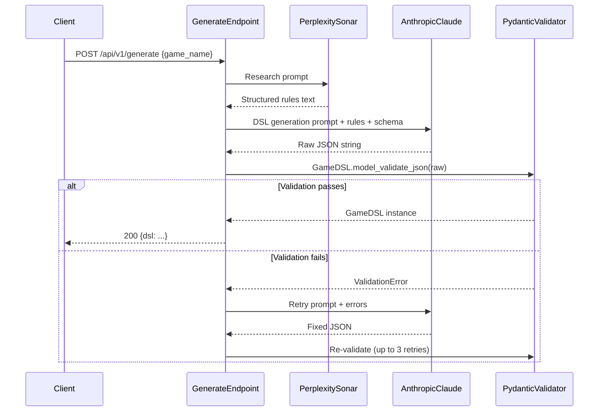

# Card Game DSL: Pydantic Schema, Prompts, and Pipeline

## 1. Why the current DSL needs to grow

The `uno.json` DSL is already expressive, but Exploding Kittens and Monopoly Deal require operations that don't exist yet:

| Game | Missing capability | New ops needed |
| ---- | ------------------ | -------------- |

- **Exploding Kittens**: Interrupt/reaction system (Nope), peek at deck (See the Future), insert card at arbitrary position (Defuse), card combos (2-of-a-kind steal) -- needs `peek`, `insert_at`, `target_player`, `react_window`
- **Monopoly Deal**: Multiple per-player zones (hand, bank, properties), targeted theft (Sly Deal, Deal Breaker), payment/debt mechanics, set-completion win condition -- needs `target_player`, `transfer`, `check_sets`, richer win conditions

## 2. Pydantic schema design ([backend/app/schemas/**init**.py](backend/app/schemas/__init__.py))

Use **discriminated unions** on the `op` field so each operation type has its own validation, and `model_json_schema()` exports a clean vocabulary for the LLM.

### Key models (sketch)

```python
# -- Meta --
class PlayerCount(BaseModel):
    min: int = Field(ge=2)
    max: int = Field(ge=2)

class GameMeta(BaseModel):
    game_name: str
    version: str = "1.0"
    player_count: PlayerCount
    win_condition: Literal[
        "first_empty_hand",      # Uno
        "last_player_standing",  # Exploding Kittens
        "collection_target",     # Monopoly Deal (3 complete sets)
        "most_points",           # generic scoring
    ]
    win_params: dict[str, Any] | None = None  # e.g. {"sets_needed": 3}

# -- Assets --
class CardTemplate(BaseModel):
    id: str
    template_vars: dict[str, list[str | int]] | None = None
    data: dict[str, Any]
    img: str
    per_combination: int = Field(ge=1)

class Assets(BaseModel):
    deck_manifest: list[CardTemplate]

# -- Zones --
class ZoneOnEmpty(BaseModel):
    sequence: list["Operation"]

class Zone(BaseModel):
    behavior: Literal["stack", "hand_fan", "spread", "grid"]
    visibility: Literal["hidden", "top_only", "owner_only", "public"]
    per_player: bool = False
    on_empty: ZoneOnEmpty | None = None

# -- Variables --
class VarDef(BaseModel):
    type: Literal["number", "string", "boolean"]
    default: Any

class Variables(BaseModel):
    global_vars: dict[str, VarDef] = Field(alias="global")
    per_player: dict[str, VarDef] = {}

# -- Operations (discriminated union) --
class MoveOp(BaseModel):
    op: Literal["move"]
    entity: str | None = None    # "$card" reference
    from_: str | None = Field(None, alias="from")
    to: str
    count: int | str | None = None
    store_as: str | None = None

class ShuffleOp(BaseModel):
    op: Literal["shuffle"]
    zone: str

class BranchOp(BaseModel):
    op: Literal["branch"]
    condition: dict[str, Any]  # nested condition tree
    if_true: list["Operation"]
    if_false: list["Operation"] = []

class PeekOp(BaseModel):
    op: Literal["peek"]
    zone: str
    count: int
    player: str  # who sees them
    store_as: str | None = None

class InsertAtOp(BaseModel):
    op: Literal["insert_at"]
    entity: str
    zone: str
    position: str | int  # "top", "bottom", or player-chosen index

class TargetPlayerOp(BaseModel):
    op: Literal["target_player"]
    player: str
    exclude_self: bool = True
    store_as: str

class ReactWindowOp(BaseModel):
    op: Literal["react_window"]
    eligible: str           # "$all_other_players"
    card_match: dict        # e.g. {"data.type": "nope"}
    timeout_ms: int = 10000
    on_react: list["Operation"]
    on_timeout: list["Operation"]

class PromptOp(BaseModel):
    op: Literal["prompt"]
    player: str
    kind: Literal["choose_option", "choose_card", "choose_position"]
    options: list[str] | None = None
    message: str
    store_as: str

# ... (15-20 total op types)

Operation = Annotated[
    Union[MoveOp, ShuffleOp, BranchOp, PeekOp, InsertAtOp, ...],
    Field(discriminator="op")
]
```

### Design principles

- **Discriminated union on `op**`: Pydantic validates each operation's specific fields; `model_json_schema()`emits a`oneOf`with`op` as discriminator -- this becomes the LLM's vocabulary.
- `**$`-prefixed references (e.g. `$card`, `$player.hand`, `$global.stack_penalty`): Kept as strings; validated at runtime by the game engine, not Pydantic. Pydantic just checks structural correctness.
- `**win_condition` as enum + `win_params` dict: Generalizes across "empty hand" (Uno), "survival" (EK), and "collection" (Monopoly Deal) without an explosion of fields.
- `**react_window` op: The key generalization for interrupt-style mechanics (Nope, Just Say No). It opens a timed window for other players to respond.

## 3. Prompt templates

### 3a. Perplexity Sonar -- structured rules extraction

Store at `backend/app/prompts/research.py` or as a string constant.

```
You are a board game rules researcher. Find the complete official rules for "{game_name}".

Extract the following in structured sections:

**CARD_TYPES**
For each distinct card type: name, quantity in deck, any variants (colors/numbers), and exact effect when played.

**SETUP**
Step-by-step setup: deck preparation, cards dealt per player, initial zone layout.

**TURN_STRUCTURE**
Phases of a turn. Actions available in each phase. Whether a player MUST or MAY take each action.

**REACTIONS**
Any cards playable out-of-turn (interrupts, counters). Timing rules.

**WIN_CONDITION**
Exact condition(s) to win. Any elimination rules.

**SPECIAL_RULES**
Penalties, challenges, stacking, card combos, and any edge cases.

Be exhaustive with card counts and precise about effect wording.
```

**Why this works for generalization**: By extracting into fixed sections that map 1:1 to DSL blocks (CARD_TYPES -> `deck_manifest`, SETUP -> `routines.setup`, TURN_STRUCTURE -> `fsm`, REACTIONS -> `react_window` ops), the downstream DSL generation prompt can systematically map each section.

### 3b. DSL generation prompt

```
You are a card game DSL compiler. Convert the game rules below into a JSON document that conforms EXACTLY to the provided JSON Schema.

## RULES
{perplexity_output}

## JSON SCHEMA (your output MUST validate against this)
{json_schema}

## OPERATION REFERENCE
{op_vocabulary_with_descriptions}

## EXAMPLE (Uno)
{uno_json}

## INSTRUCTIONS
1. Every card type in CARD_TYPES -> a deck_manifest entry. Use template_vars for parameterized cards (colors x values).
2. Every play area -> a zone. Use per_player: true for player-specific zones.
3. SETUP steps -> the "setup" routine, using only ops from the vocabulary.
4. Each TURN_STRUCTURE phase -> an FSM routine. Actions -> the "actions" block with conditions and sequences.
5. REACTIONS -> use react_window ops to open interrupt windows where needed.
6. WIN_CONDITION -> meta.win_condition + win_params, and a game_over op in the appropriate sequence.
7. SPECIAL_RULES -> card_effects entries and/or branch ops in routines.

Output ONLY the JSON object. No markdown fences, no commentary.
```

### 3c. Validation error retry prompt

```
The JSON you produced failed schema validation:

{validation_errors}

Fix ONLY the structural issues listed above. Do not change game logic unnecessarily. Output the corrected JSON only.
```

### Key prompting techniques for generalization

- **Schema-as-prompt**: `GameDSL.model_json_schema()` is injected directly. The LLM sees every field, type constraint, and enum value.
- **Operation vocabulary reference**: A separate human-readable list of each op with a 1-line description and parameter table. This is more digestible than raw JSON Schema for the `Operation` union.
- **Sectioned extraction -> sectioned mapping**: The Perplexity prompt and DSL prompt use the same section names, creating a clear mapping the LLM can follow.
- **Few-shot example**: `uno.json` shows the target format concretely. Adding a second example (e.g. Exploding Kittens) for games with reactions would significantly improve generalization.
- **Retry loop with typed errors**: Pydantic `ValidationError` produces precise, field-level error messages that are highly actionable for the LLM.

## 4. Orchestration endpoint

New file: [backend/app/routers/generate.py](backend/app/routers/generate.py)



### Endpoint structure

```python
class GenerateRequest(BaseModel):
    game_name: str
    rules_text: str | None = None  # optional pre-provided rules

class GenerateResponse(BaseModel):
    dsl: GameDSL
    research_text: str  # the Perplexity output, for debugging

@router.post("/generate", response_model=GenerateResponse)
async def generate_dsl(req: GenerateRequest):
    # 1. Research
    rules = req.rules_text or await research_game(req.game_name)

    # 2. Generate + validate loop
    schema = GameDSL.model_json_schema()
    dsl = await generate_and_validate(rules, schema, max_retries=3)

    return GenerateResponse(dsl=dsl, research_text=rules)
```

### The validation loop (`generate_and_validate`)

```python
async def generate_and_validate(rules: str, schema: dict, max_retries: int = 3) -> GameDSL:
    raw = await call_llm(build_generation_prompt(rules, schema))

    for attempt in range(max_retries):
        try:
            return GameDSL.model_validate_json(raw)
        except ValidationError as e:
            errors = e.json()
            raw = await call_llm(build_retry_prompt(raw, errors))

    raise HTTPException(422, "Failed to generate valid DSL after retries")
```

## 5. File plan

- **[backend/app/schemas/init.py](backend/app/schemas/__init__.py)** -- All Pydantic models: `GameDSL`, `GameMeta`, `Assets`, `Zone`, `Variables`, `CardEffect`, `FSM`, and the `Operation` discriminated union (roughly 300-400 lines)
- **[backend/app/prompts/](backend/app/prompts/)** (new directory) -- `research.py` (Perplexity prompt template), `generate.py` (DSL generation prompt template + op vocabulary reference), `retry.py` (validation error retry prompt)
- **[backend/app/routers/generate.py](backend/app/routers/generate.py)** (new file) -- `/generate` endpoint with the research -> generate -> validate pipeline
- **[backend/app/main.py](backend/app/main.py)** -- Register the new router
- **[backend/app/examples/exploding_kittens.json](backend/app/examples/exploding_kittens.json)** (new file) -- Second few-shot example to improve generalization for reaction/interrupt games
